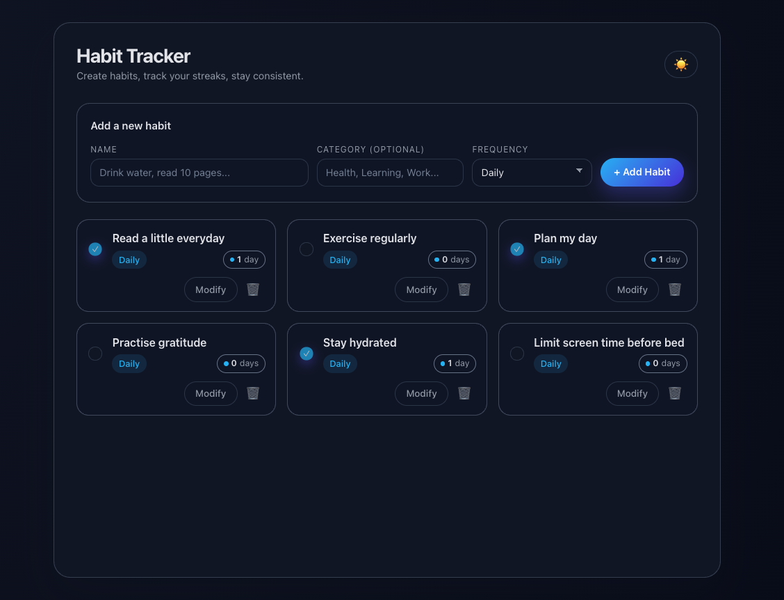

# Daily Habits Board API

An API and client application designed to track personal habits and their progress. Examples of habits include “drink water,” “read for 20 minutes,” or “stretch your back.” Each habit stores a frequency and a counter for completed days.



## ✨ Features

- User authentication (register, login, logout)
- User-specific habits (each user manages their own habits)
- Persistent login (remembers session securely)
- Add, edit, and delete habits
- Mark a habit as completed (daily/weekly/monthly tracking)
- View progress statistics and streaks for each habit
- Filter habits by category
- Responsive dark mode toggle
- RESTful API with clean models and validations
- Modern web client built with React + TypeScript + Vite
- Simple database migrations with Entity Framework Core

## 🛠️ Technologies

- ASP.NET Core (.NET 9)
- Entity Framework Core
- React (TypeScript)
- Vite
- RESTful API design

## 🗂️ Project Structure

- `Controllers/` — ASP.NET Core API controllers
- `Models/` — Entity and context models for habits
- `Migrations/` — Database migrations (EF Core)
- `client/` — Frontend React app (TypeScript, Vite)
- `appsettings.json` — API configuration

## 📦 Requirements

- .NET 9 SDK
- Node.js (for client)
- Any editor (VS Code recommended)

## 🚀 Running the Project

```bash
# Start the API
dotnet run

# In a separate terminal, start the client
cd client
npm install
npm run dev
```

## 🎯 Purpose

This project provides a simple environment to strengthen your understanding of REST APIs in ASP.NET Core and modern frontend development. It focuses on clear route design, data validation, lightweight CRUD operations, and a responsive web client.